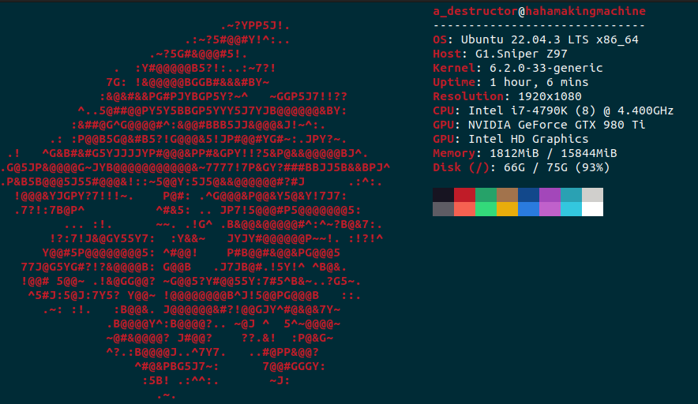

# Linux_Kernel_Built_For_RPi4

This is a Linux kernel configured and built for Raspberry Pi 4. This README file will walk you through the process as I experienced it.

Notes:
  1. This kernel was built on 12/9/2023. Some steps may differ/be omitted altogether. Please, bare in mind that U-Boot is a piece of software that gets updated constantly and your steps may vary depending on when you decide to build/use it.
  2. This kernel was built on an Ubuntu 22.04 system on my trusty ten-year-old PC with the following specs:
       1. i7 4790k @4.4GHz
       1. 16GB DDR3 RAM @2400MHz
       1. GTX 980ti (irrelevant to this project) \
This piece of info is a bit irrelevant for this project since the built was done under a minute.
       1. A Kingston HyperX Savage SSD.
       
       
        
  3. The kernel was built for Raspberry Pi 4 using a custom cross-toolchain I created in an earlier project. Feel free to visit it for more detail: [Crosstool-NG_RPi4](https://github.com/AhmedAlyEl-Ghannam/Crosstool-NG_RPi4). Additionally, the U-Boot-based bootloader I created in an earlier project is also needed: [Our-Boot_U-Boot_bootloader_for_RPi4](https://github.com/AhmedAlyEl-Ghannam/Our-Boot_U-Boot_bootloader_for_RPi4)
  4. The source I followed is Chris Simmond's book "Mastering Embedded Linux Programming - Second Edition" chapter 4: Configuring and Building the Kernel. It is a fantastic book that I STRONGLY recommend. But, bear in mind that the instructions listed in the chapter are for Beaglebone Black. If you use any other single board computer, you are on your own. If you decide to use Raspberry Pi 4, you came to the right place comrade.

     *I will continue this tomorrow cuz I want to sleep rn*
