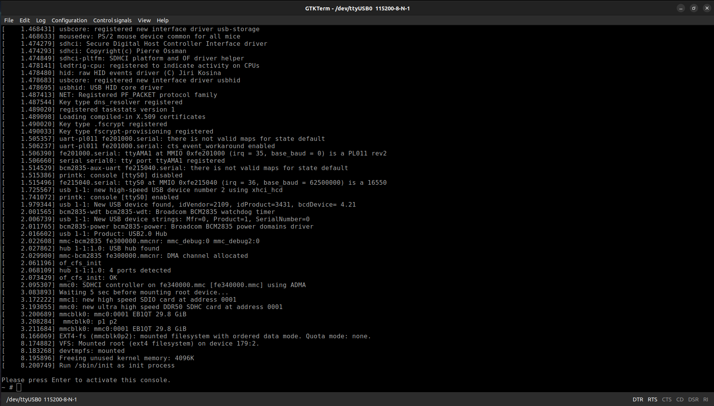

# Root_and_Utils_Using_Busybox

This is a simple Linux root filesystem with basic utilities configured and built for Raspberry Pi 4 using Busybox. This README file will walk you through the process as I experienced it.

Notes:
  1. This filesystem was built on 15/9/2023. Some steps may differ/be omitted altogether. Please, bare in mind that Busybox is a piece of software that gets updated constantly and your steps may vary depending on when you decide to build/use it.
  2. This filesystem was built on an Ubuntu 22.04 system on my trusty ten-year-old PC with the following specs:
       1. i7 4790k @4.4GHz
       1. 16GB DDR3 RAM @2400MHz
       1. GTX 980ti (irrelevant to this project) 
       1. A Kingston HyperX Savage SSD.
       
       
        
  3. The filesystem was built for Raspberry Pi 4 using a custom cross-toolchain I created in an earlier project. Feel free to visit it for more detail: [Crosstool-NG_RPi4](https://github.com/AhmedAlyEl-Ghannam/Crosstool-NG_RPi4). Additionally, I created both a U-Boot-based bootloader and compiled a Linux kernel in earlier projects that can be found here: [Our-Boot_U-Boot_bootloader_for_RPi4](https://github.com/AhmedAlyEl-Ghannam/Our-Boot_U-Boot_bootloader_for_RPi4) and [Linux_Kernel_Built_For_RPi4](https://github.com/AhmedAlyEl-Ghannam/Linux_Kernel_Built_For_RPi4).
  4. The source I *mostly* followed is Chris Simmond's book "Mastering Embedded Linux Programming - Second Edition" chapter 5: Building a
Root Filesystem. It is a fantastic book that I STRONGLY recommend. But, bear in mind that the instructions listed in the chapter are for Beaglebone Black. If you use any other single board computer, you are on your own. If you decide to use Raspberry Pi 4, you came to the right place comrade.


## Prerequisites

1. Create a folder in your home directory and name it `rootfs`.

   ```
   mkdir ~/rootfs
   ```


2. Change this folder's owner to `root`. This folder will be the setup path of Busybox and I do not want any traces of my OS to be showing in the final root filesystem.

   ```
   sudo chown -R root:root *
   ```


## Building and Installing Busybox

1. Clone the Busybox repository. Make sure to clone it where you want to use it.

   ```
   git clone git://busybox.net/busybox.git
   ```


2. Open the cloned repository folder and make sure you are operating on the latest branch. `1_36_stable` is the latest branch as of the time of writing this README file.

   ```
   cd busybox
   git checkout remotes/origin/1_36_stable
   ```


3. Start by wiping previously compiler files that may have made their way to your folder. Then, select the default configuration since it will be more than enough for the system I am building.

   ```
   make distclean
   make defconfig
   ```


4. I will be cross compiling using toolchain I created in an earlier project, so make sure to define its path.

  ```
  PATH=${HOME}/x-tools/aarch64-rpi4-linux-gnu/bin/:$PATH
  ```


5. Open the TUI configuration menu and adjust the following:
    
     1. Settings -> Build static binary 	(no shared libraries) 	Enable
     1. Settings -> Cross compiler prefix 	aarch64-rpi4-linux-gnu-
     1. Settings -> Destination path for ‘make install’ /home/a_destructor/rootfs

    
    
    
    

7. Build it!

   ```
   make -j8
   ```


8. Install it!

   ```
   make install
   ```


The result will be these three folders located in `rootfs`: `usr`, `bin`, and `sbin`.


## Adding a Few Adjustments to this Root Filesystem

1. Create the following directories in `rootfs` using this command:

   ```
   sudo mkdir {proc, sys, dev, etc}
   sudo mkdir etc/init.d
   touch etc/init.d/rcS
   chmod +x etc/init.d/rcS
   ```


2. Add the following entries to etc/init.d/rcS:
   ```
   #!/bin/sh
   mount -t proc none /proc
   mount -t sysfs none /sys

   echo /sbin/mdev > /proc/sys/kernel/hotplug
   mdev -s  # -s	Scan /sys and populate /dev\n"
   ```


## Install the Root Filesystem

Simply, just copy all the contents of `rootfs` to your root partition.

  ```
  sudo cp -r ~/rootfs/* /media/a_destructor/root/
  ```


## Boot That Pi!

Finally, it is time to plug my sd card into the Pi and boot it.

1. Connect your USB to TTL to both your PC and Pi.


2. Open your serial terminal of choice.

   ```
   gtkterm -p /dev/ttyUSB0 -s 115200
   ```


3. Power on the Pi.


4. You should see a glorious screen like this.

     


### Finally, I can get some sleep


